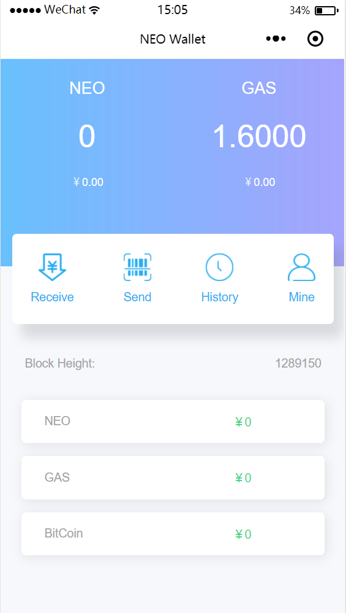
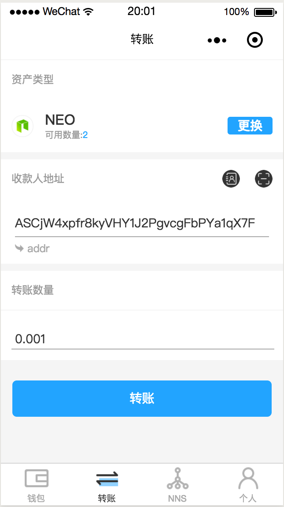
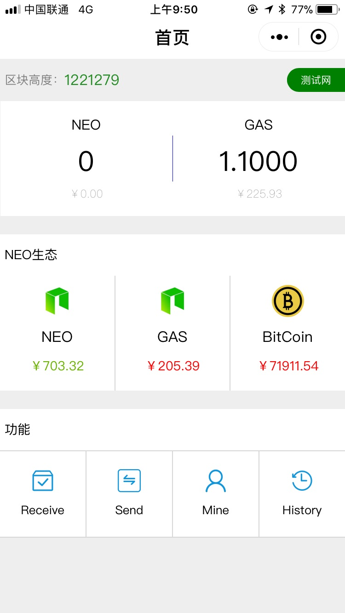
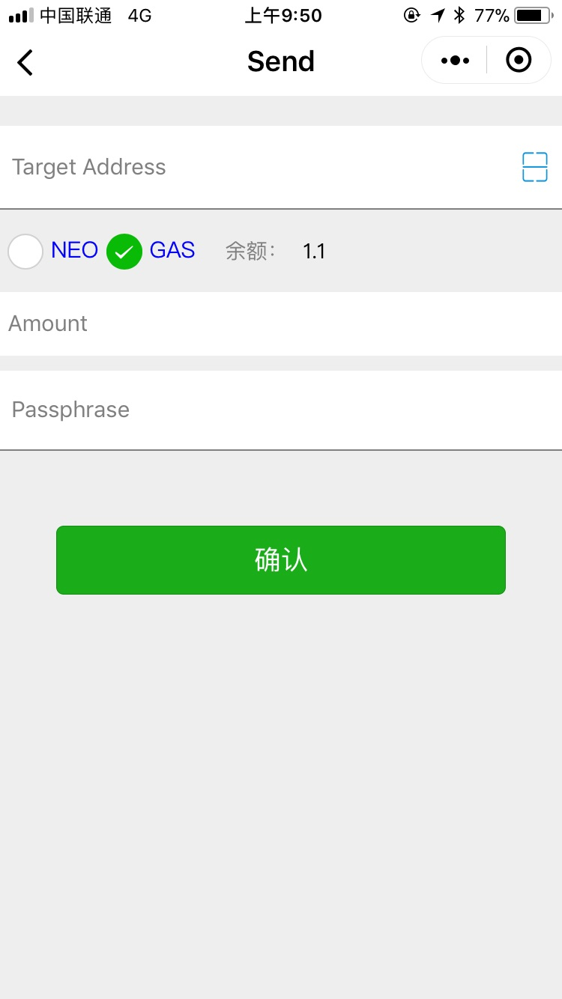
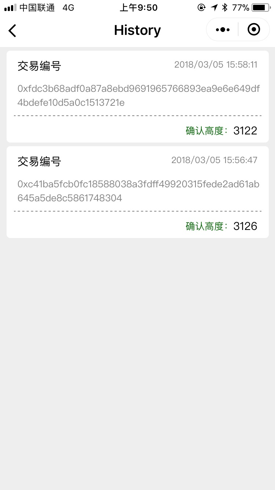
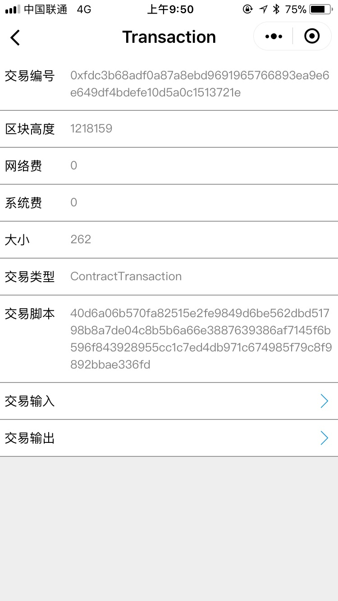
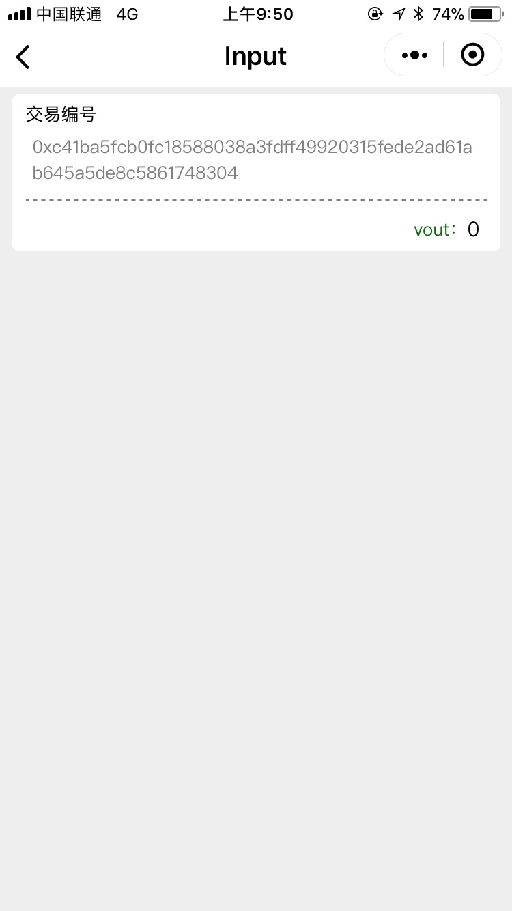
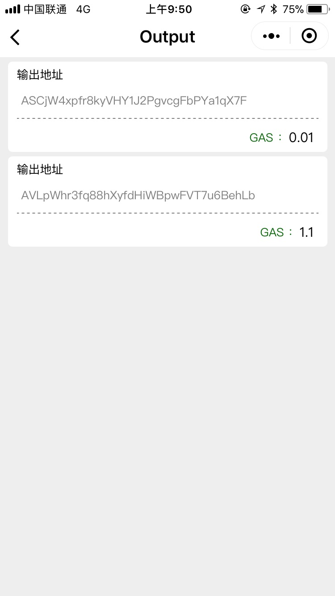
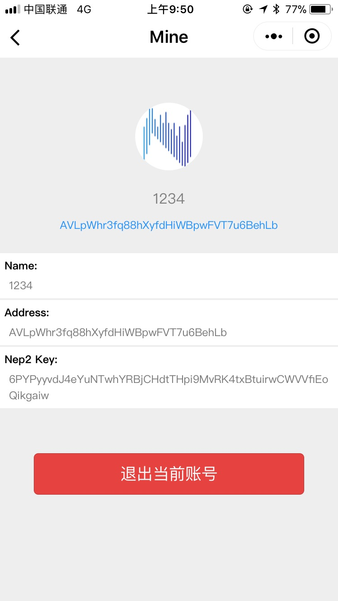

# NEO wallet for WeChat mini program
================

This project is developed with the help and support from [NEL](https://github.com/NewEconoLab/) community. Join the community and learn NEO developing at:
- 点击链接加入群【NEO开发 从入门到放弃】：https://jq.qq.com/?_wv=1027&k=5erIkal
- 点击链接加入群【NEL区块链技术交流】：https://jq.qq.com/?_wv=1027&k=57bF3he

## Mini Program QRCode

<p align="center">
  
</p>

## Developing Plan
- 小程序设计为直接私钥登陆（如需要nep2之后再加），不再尝试兼容nep6
- UI风格主题模仿NEM小程序，特色部分学习O3，界面细节后期与设计讨论
- 删除各个登陆场景的界面，直接在index界面处理
- 功能抽象及封装，将模块中重耦合部分分层
- 代码瘦身，将SDK中与node库重复的功能模块删除减小项目大小 当前大小：500k 预计瘦身后大小 400k
- 完全重写界面：receive，send，mine，loginWIF，home
- 删除界面： loginNep2,loginLocal

## ScreenCapture
### New Version
<div>


</div>

### Old Version
<div>




</div>
<div>




</div>

## Usage

### Start

``` bash
git clone https://github.com/NewEconoLab/NeoWalletForWeChat.git

cd NeoWalletForWeChat

npm install wepy-cli -g
npm install

npm run dev
```


> **Remind**
- 使用微信开发者工具新建项目，本地开发**选择 `dist` 目录**
- 微信开发者工具 -> 项目
  - **关闭** ES6 转 ES5
  - **关闭** 代码压缩上传
  - **关闭** 上传代码时样式文件自动补全
  - **开启** 开发环境不校验请求域名、TLS版本以及HTTPS证书


### Build&Watch

```
wepy build --watch
```

## Dependencies

- [wepy](https://github.com/Tencent/wepy)
- [ThinSDK-ts](https://github.com/NewEconoLab/neo-thinsdk-ts)
- [nodejs](https://github.com/nodejs/node)
- [secure-random-wechat](https://github.com/Liaojinghui/secure-random-wechat)


## LICENSE

[LICENSE](https://github.com/NewEconoLab/NeoWalletForWeChat/blob/master/LICENSE)

Please note that the open source protocol for this repository is **MIT**. This means that you have the freedom to run, copy, modify and distribute the software. 

## Author

- Jinghui Liao <jinghui@wayne.edu>

## Donation

- NEO/GAS: ASCjW4xpfr8kyVHY1J2PgvcgFbPYa1qX7F

